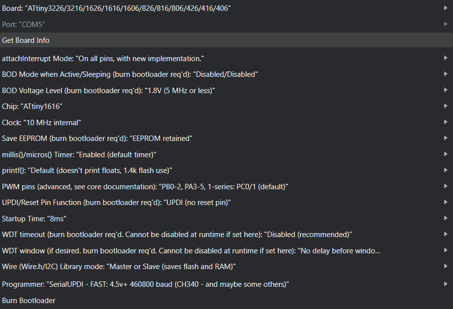
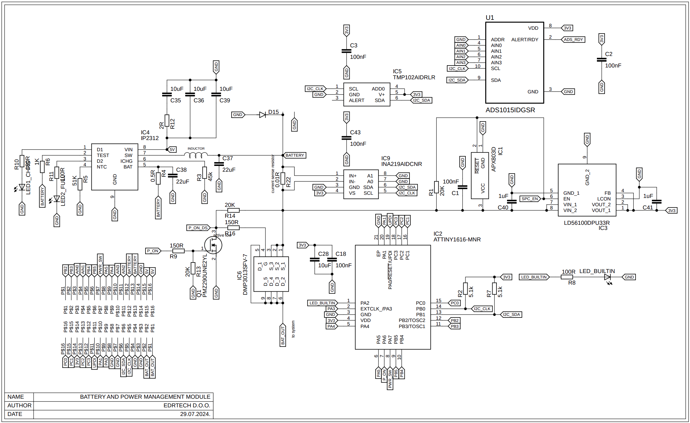
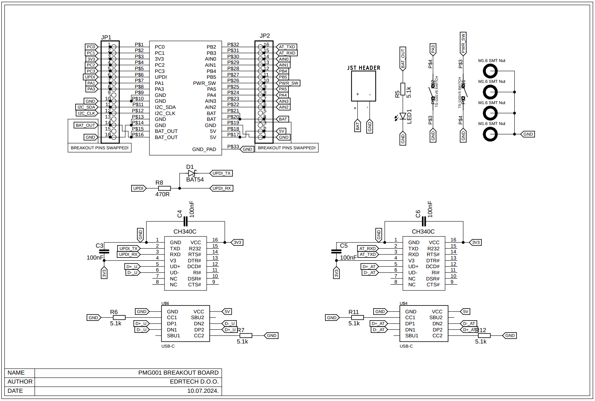

# PMG001 Power management module

The PMG001 is a highly integrated module designed for efficient management of single-cell
Li-Po battery systems. It incorporates various essential ICs to address all aspects of power
management, including battery charging, switch/button power on/off behavior, undervoltage
and overvoltage protection, flexible voltage measurement, battery current measurement, and
temperature monitoring. Additionally, it features a microcontroller for programming custom
behaviors, ensuring comprehensive management of single-cell rechargeable battery
systems.
Furthermore, when paired with the demo kit base PCB, the module serves as a general
development board for the ATTINY1616, with all
1 pins accessible for any application.

## Features

- 32 PIN 22.22mm *16.51mm package
- On/off behavior control
- 2A single cell charger
- Single li-po cell powered
- 4+16 ADC channels
- Bi-directional battery current measurement
- Brown-out detection/reset circuit
- Low RDSon battery output MOSFET
- On-module temperature measurement
- I2C Interface
- Arduino compatible

## Installation

To program this module you will need the following:

- Arduino DE (Or other IDE of your choosing)
- [megaTinyCore](https://github.com/SpenceKonde/megaTinyCore)
- Demo kit with the module soldered on

There's no need to install any additional libraries as the example code only uses the wire library to handle I2C, the rest is in the [example](pmg001_default/pmg001_default.ino) code. Keep in mind that some register values are hardcoded, which is not the best way to handle something like that but is done here for the sake of simplicity. You can use external libraries with this module without issues, you just need to redefine I2C adresses of devices as they don't necessarily match with other libraries.

Board settings should be set up like this:

Default code provides basic power management and monitoring - press PWR_SW for >500ms and BAT_OUT will turn on, hold PWR_SW for >3s and BAT_OUT will turn off.

For more information, please read the [datasheet](PMG001_datasheet.pdf).

    
## Module Schematic

## Breakout board Schematic

