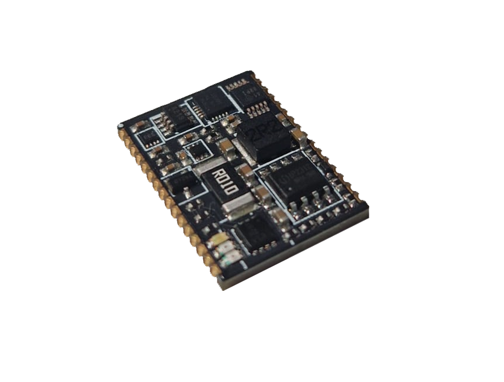

# PMG001 Power management module

The PMG001 is a highly integrated module designed for efficient management of single-cell
Li-Po battery systems. It incorporates various essential ICs to address all aspects of power
management, including battery charging, switch/button power on/off behavior, undervoltage
and overvoltage protection, flexible voltage measurement, battery current measurement, and
temperature monitoring. Additionally, it features a microcontroller for programming custom
behaviors, ensuring comprehensive management of single-cell rechargeable battery
systems.
Furthermore, when paired with the demo kit base PCB, the module serves as a general
development board for the ATTINY1616, with all
1 pins accessible for any application.

## Features

- 32 PIN 22.22mm *16.51mm package
- On/off behavior control
- 2A single cell charger
- Single li-po cell powered
- 4+16 ADC channels
- Bi-directional battery current measurement
- Brown-out detection/reset circuit
- Low RDSon battery output MOSFET
- On-module temperature measurement
- I2C Interface
- Arduino compatible